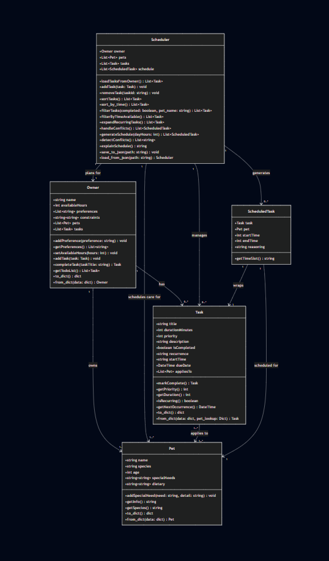

# PawPal+ (Module 2 Project)

You are building **PawPal+**, a Streamlit app that helps a pet owner plan care tasks for their pet.

## Scenario

A busy pet owner needs help staying consistent with pet care. They want an assistant that can:

- Track pet care tasks (walks, feeding, meds, enrichment, grooming, etc.)
- Consider constraints (time available, priority, owner preferences)
- Produce a daily plan and explain why it chose that plan

Your job is to design the system first (UML), then implement the logic in Python, then connect it to the Streamlit UI.

## What you will build

Your final app should:

- Let a user enter basic owner + pet info
- Let a user add/edit tasks (duration + priority at minimum)
- Generate a daily schedule/plan based on constraints and priorities
- Display the plan clearly (and ideally explain the reasoning)
- Include tests for the most important scheduling behaviors

## Getting started

### Setup

```bash
python -m venv .venv
source .venv/bin/activate  # Windows: .venv\Scripts\activate
pip install -r requirements.txt
```

### Suggested workflow

1. Read the scenario carefully and identify requirements and edge cases.
2. Draft a UML diagram (classes, attributes, methods, relationships).
3. Convert UML into Python class stubs (no logic yet).
4. Implement scheduling logic in small increments.
5. Add tests to verify key behaviors.
6. Connect your logic to the Streamlit UI in `app.py`.
7. Refine UML so it matches what you actually built.

## ✨ Features

PawPal+ is built around a small set of scheduling algorithms that turn a raw
list of pet-care tasks into an ordered, conflict-aware daily plan.

- **Priority-first sorting** — `sortTasks()` orders tasks by priority
  (1 = high → 3 = low), breaking ties by start time and then by longer duration
  first, so the most urgent work always rises to the top.
- **Chronological sorting** — `sort_by_time()` re-orders tasks by their `HH:MM`
  start time (then priority). Because times are zero-padded, a plain string
  compare gives correct chronological order with no datetime parsing.
- **Capacity-aware filtering** — `filterByTimeAvailable()` walks tasks in
  priority order and greedily keeps only what fits inside the owner's available
  hours, dropping the rest once the daily time budget is spent.
- **Conflict warnings** — `detectConflicts()` compares every pair of task time
  windows and flags overlaps. Overlaps on the *same pet* are labelled as pet
  conflicts; overlaps across *different pets* are flagged as owner-time
  conflicts (the owner can only be in one place at once).
- **Conflict resolution** — `handleConflicts()` pushes overlapping blocks
  forward so the generated schedule stays contiguous and non-overlapping.
- **Daily / weekly / monthly recurrence** — `Task.isRecurring()`,
  `getNextOccurrence()`, and `markComplete()` compute the next occurrence of a
  recurring task. Completing a daily task returns a fresh copy due one day
  later; weekly advances a week; one-off tasks return `None`.
- **Automatic re-queue** — `Owner.completeTask()` removes a finished task and,
  if it recurs, drops its next occurrence back onto the to-do list so the plan
  never runs dry.
- **Schedule generation** — `generateSchedule(dayHours)` combines filtering,
  slot-packing, and conflict resolution in one call, and `explainSchedule()`
  returns a human-readable rationale for each scheduled block.
- **Task filtering** — `filterTasks(completed, pet_name)` narrows the list by
  completion status, by pet, or both.
- **Persistence** — `save_to_json()` / `load_from_json()` store the owner,
  pets, and tasks to disk so the app restores state across runs.

## 🧪 Testing PawPal+

Run the full test suite from the project root:

```bash
python -m pytest tests/test_pawpal.py -v
```

All 59 tests are in `tests/test_pawpal.py` and cover the following behaviors:

| Area | What is tested |
|---|---|
| **Sorting** (`sortTasks`, `sort_by_time`) | High-priority tasks come before low-priority; ties broken by start time then duration; neither method mutates the original list |
| **Recurrence** (`Task.markComplete`) | Daily tasks produce a next occurrence due exactly one day later; weekly tasks advance by one week; `once` tasks return `None`; the returned task has `isCompleted=False`; casing variants like `"DAILY"` are handled |
| **Conflict detection** (`detectConflicts`) | Exact and partial overlaps are flagged; same-pet conflicts name the pet; different-pet overlaps are labelled as owner-time conflicts; adjacent (non-overlapping) tasks are not flagged |
| **Owner task management** (`completeTask`, `getTodoList`) | Completing a once task removes it; completing a daily task replaces it with the next occurrence; unknown titles return `None` safely; `getTodoList` excludes completed tasks |
| **Schedule generation** (`generateSchedule`) | Tasks appear in sequence; a 30-minute task occupies a 1-hour slot (due to `max(1, duration//60)` rounding); completed tasks are skipped; schedule is capped at `min(dayHours, owner.availableHours)` |
| **Capacity filtering** (`filterByTimeAvailable`) | Tasks too long to fit alone are dropped; high-priority tasks are kept when capacity runs out; zero available hours returns an empty list |
| **Task filtering** (`filterTasks`) | Filter by completion status, by pet name, or both combined; no filters returns all tasks |
| **Task removal** (`removeTask`) | Removes only the matching task; other tasks are unchanged; nonexistent titles and empty lists do not raise |

Sample test output:

```
========================================= test session starts ==========================================
platform win32 -- Python 3.14.3, pytest-9.1.1, pluggy-1.6.0
rootdir: C:\Users\adike\Documents\CODEPATH\ai110-module2show-pawpal-starter
plugins: anyio-4.14.1
collected 59 items                                                                                      

tests\test_pawpal.py ...........................................................                  [100%]

========================================== 59 passed in 0.61s ==========================================
```

Confidence Level
⭐⭐⭐⭐(4/5)

## 📐 Smarter Scheduling

| Feature | Method(s) | Notes |
|---------|-----------|-------|
| Task sorting | `Scheduler.sortTasks()`, `Scheduler.sort_by_time()` | `sortTasks()` orders by priority then start time; `sort_by_time()` orders chronologically then priority |
| Filtering | `Scheduler.filterTasks(completed, pet_name)` | Filters by completion status, by pet, or both; either argument is optional |
| Skip tasks if time runs out | `Scheduler.filterByTimeAvailable()` | Greedy priority-order walk; drops tasks once the owner's available hours are exhausted |
| Conflict detection | `Scheduler.detectConflicts()` | Flags overlapping task pairs as "same pet" or "owner time" conflicts; returns warning strings |
| Conflict resolution | `Scheduler.handleConflicts()` | Pushes overlapping blocks forward so the schedule stays contiguous; called automatically by `generateSchedule()` |
| Recurring tasks | `Task.isRecurring()`, `Task.getNextOccurrence()`, `Task.markComplete()` | `isRecurring()` checks cadence; `getNextOccurrence()` computes the next datetime (daily/weekly/monthly); `markComplete()` returns a fresh copy advanced by one period |
| Recurring auto-requeue | `Owner.completeTask(taskTitle)` | Removes the completed task and re-adds the next occurrence so the to-do list stays stocked |
| Schedule generation | `Scheduler.generateSchedule(dayHours)` | Combines filtering, slot-packing, and conflict resolution into one call |

## 📸 Demo Walkthrough

Describe your app in numbered steps so a reader can follow along without watching a video:

1. **Set up the owner** — enter the owner's name (**Crystal**) and *available hours today* (**8**), then save. This is the daily time budget the scheduler packs against. Add any preferences (e.g. "morning walks only").
2. **Add a pet** — add **Luna** (Dog, 3 yrs). Pet names must be unique because they are the persistence key. Record a special need for the active pet (`medication: allergy pill with breakfast`).
3. **Schedule tasks** — add tasks with a title, duration, priority, recurrence (`once` / `daily` / `weekly`), start time, and the pet(s) they apply to: a `daily` **Morning Walk** at 07:00 (60 min, high), a `daily` **Medication Check** at 09:00 (10 min, medium), and a `weekly` **Grooming Session** at 14:00 (45 min, low). Tasks get an inferred type emoji (🚶 walk, 🍽️ feeding, 💊 meds…) and a color-coded priority badge (🔴/🟡/🟢).
4. **Sort, filter & spot conflicts** — sort the task list by **priority** or **start time** and filter it by pet. A live banner warns about overlapping time windows: same-pet overlaps vs owner-time overlaps.
5. **Build & view today's schedule** — click **Generate schedule** to pack tasks into slots (capacity filtering + conflict resolution) and view the plan as a table. Open **See reasoning** for the per-task rationale. Marking a `daily`/`weekly` task complete automatically re-queues its next occurrence.

**Key Scheduler behaviors shown:** priority-first and chronological **sorting**, **capacity filtering** to the owner's available hours, **conflict warnings** (same-pet vs owner-time), **recurrence** (completed recurring tasks advance to their next occurrence), and **schedule generation** with contiguous, conflict-free slots.

**Screenshot or video** *(optional)*: 

## Sample Output

Sample CLI output from running `python main.py`:

```text
=======================================================
  SORT — sort_by_time() by HH:MM string, then priority
=======================================================
After sort_by_time()  →  sorted(tasks, key=lambda t: (t.startTime, t.priority)):
  [07:00] priority=1  Morning Walk           (pending)
  [08:00] priority=1  Feed Pets              (pending)
  [09:00] priority=2  Medication Check       (pending)
  [10:00] priority=2  Vet Checkup            (done)
  [14:00] priority=3  Grooming Session       (pending)
  [15:00] priority=3  Playtime               (pending)
  [18:00] priority=1  Evening Feeding        (pending)

filterByTimeAvailable (8 hrs = 480 min):
  Morning Walk (60 min)
  Feed Pets (15 min)
  Evening Feeding (15 min)
  Medication Check (10 min)
  Vet Checkup (90 min)
  Grooming Session (45 min)
  Playtime (30 min)

=======================================================
  TODAY'S SCHEDULE
=======================================================
TIME           TASK                  PET       DURATION    PRIORITY
-------------------------------------------------------------------
00:00 - 01:00  Morning Walk          Luna      60 min      High
01:00 - 02:00  Feed Pets             Luna      15 min      High
02:00 - 03:00  Evening Feeding       Luna      15 min      High
03:00 - 04:00  Medication Check      Luna      10 min      Medium
04:00 - 05:00  Grooming Session      Luna      45 min      Low
05:00 - 06:00  Playtime              Luna      30 min      Low

=======================================================
  CONFLICT DETECTION — detectConflicts()
=======================================================
Tasks loaded: 4
Conflicts found: 2

  [CONFLICT — same pet — Luna] 'Morning Walk' and 'Morning Medication' overlap (07:00-08:00 vs 07:00-07:10)
  [CONFLICT — owner time] 'Morning Walk' and 'Mochi Breakfast' overlap (07:00-08:00 vs 07:30-08:00)
```